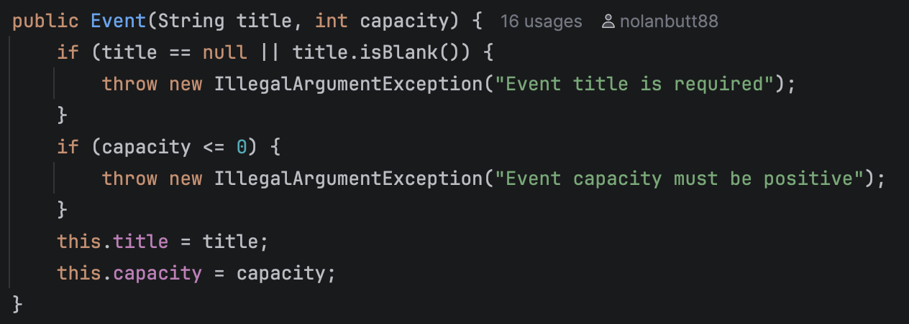
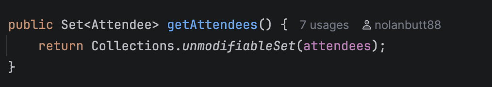
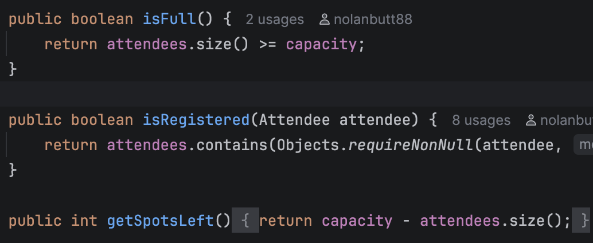

# Event Booking System

SDAT and DevOps Combined QAP 1 – Nolan Butt, Keyin College


## Project

A console Java app for creating events, registering attendees and cancelling registrations. It uses plain Java and JUnit 5.

The menu lets you create an event, register an attendee, cancel a registration, view an event and cancel an event.

| Class | Responsibility |
|-------|----------------|
| `Attendee` | Validated name and email. Two attendees are equal if their emails match, ignoring case |
| `Event` | Title, capacity and attendees. Enforces the capacity limit and rejects duplicates |
| `EventManager` | Creates, finds and cancels events, and passes registrations to the right `Event` |
| `ConsoleMenu` | Switch-based menu that reads input and prints results |
| `Main` | Starts the menu |

Invalid input throws `IllegalArgumentException`, and `ConsoleMenu` prints the message.

- **Run:** run `Main` in your IDE
- **Test:** `mvn test`

## Tests

There are 24 JUnit 5 tests covering positive and negative cases, using `assertEquals`, `assertTrue`, `assertFalse` and `assertThrows`.

| Class | Scenarios |
|-------|-----------|
| `AttendeeTest` | Email lowercased, null/blank name or email rejected, email without `@` rejected, equality and hash code ignore email case |
| `EventTest` | Register attendee, capacity limit, duplicate prevention, cancellation frees a spot, freed spot reusable, cancelling an unregistered attendee does nothing, invalid inputs rejected, attendee set is read-only |
| `EventManagerTest` | Create event, duplicate title rejected, missing event rejected, cancel event, register/cancel for a missing event rejected, events map is read-only |

## Clean code examples

**1. Fail-fast validation** (`Event` constructor): invalid input is rejected immediately, so an invalid `Event` cannot exist.

```java
if (title == null || title.isBlank()) {
    throw new IllegalArgumentException("Event title is required");
}
if (capacity <= 0) {
    throw new IllegalArgumentException("Event capacity must be positive");
}
```



**2. Encapsulation** (`Event.getAttendees`): callers get a read-only view, so only `Event` can change its data.

```java
public Set<Attendee> getAttendees() {
    return Collections.unmodifiableSet(attendees);
}
```



**3. Small methods with clear names** (`Event`): each method does one thing and reads like a sentence.

```java
public boolean isFull() {
    return attendees.size() >= capacity;
}

public int getSpotsLeft() {
    return capacity - attendees.size();
}
```



## Dependencies

| Dependency | Version | Source |
|------------|---------|--------|
| JDK | 27 | Eclipse Temurin / Oracle |
| Apache Maven | 3.x | maven.apache.org |
| JUnit Jupiter | 5.10.2 | Maven Central, via `pom.xml` (test scope) |
| Maven Surefire Plugin | 3.2.5 | Maven Central, runs the tests |

Maven downloads these automatically.

## GitHub Actions and workflow

`.github/workflows/maven.yml` runs `mvn package` (compile and all tests) on every push and pull request to `main`.

I used trunk-based development. Each feature was built on its own branch and merged into `main` by pull request: `feature/attendee`, `feature/event`, `feature/eventmanager`, `feature/mainANDreadme` and `feature/completedtestsuites`.

## Problems encountered

- **Local `main` was behind.** After merging pull requests on GitHub, my changes were not in my local `main`. `git fetch` and `git pull` fixed it.
- **Leftover stash.** Unfinished work was stashed on `feature/mainANDreadme`. I compared it to `main`, found it was already merged, and dropped it.